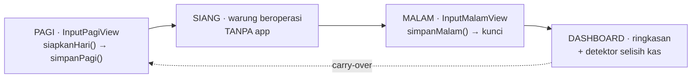
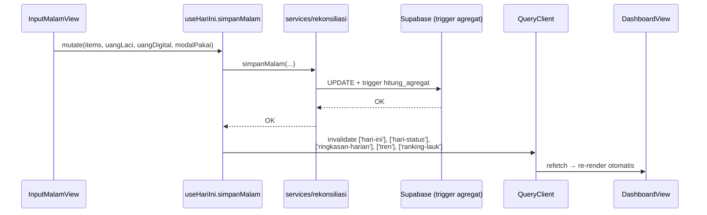
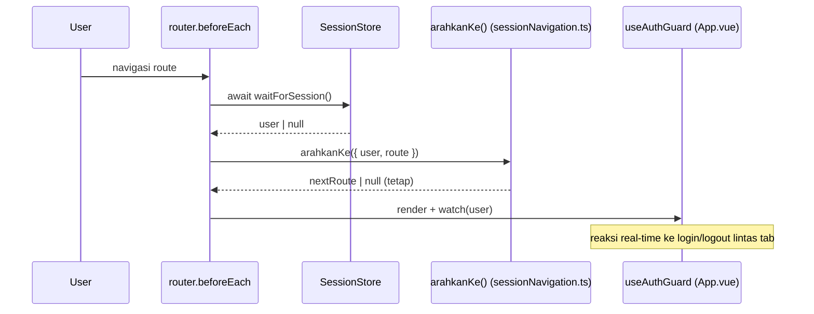

# Arsitektur Warunk

Dokumen ini melengkapi [README § Arsitektur Teknis](../README.md#arsitektur-teknis). README punya box statis; di sini kita gambar **alur** (urutan) supaya bisa dibayangkan.

## 1. Layered Architecture

Lihat diagram box di README § "Arsitektur Teknis" (Views → Composables/Stores → Lib/Services → Supabase). Ringkasnya:

- **Views (Vue SFC)**: 7 halaman lazy-loaded (`router/index.ts`).
- **Composables + Stores**: layanan data. Pinia = client state, TanStack = server state.
- **Lib / Services**: akses Supabase (`supabase.ts`, `engine.ts`, `format.ts`, `services/*`).
- **Supabase**: PostgreSQL + Auth + RLS.

## 2. Alur Kerja Tiga Fase (Data Flow)

Catatan:

- `siapkanHari()` hanya 1x fetch detail per siklus — hasil seed dipakai ulang sebagai hasil akhir (`useHariIni.ts`, `enabled: laukAktif.length > 0`).
- Carry-over **melompati hari libur**: sisa Sabtu menunggu Senin; rugi dicatat saat diperiksa di hari operasional berikutnya.

## 3. Mutasi → Invalidasi → Refetch

Aturan: setiap mutasi hari memanggil `invalidateHari()` (`useHariIni.ts:20`). `simpanMalam` menambah invalidate analitik (ringkasan/tren/ranking) karena hari terkunci mengubah agregat.

## 4. Session Guard

Satu predikat tunggal `arahkanKe` dipakai guard DAN watcher — jangan buat logika redirect lain di luar ini (lihat README § "Sesi & Navigasi").

## 5. State Ownership Map

| State | Tempat | Kapan invalid / reset |
| --- | --- | --- |
| `user`, `loading` | Pinia `stores/session.ts` | login / logout / auth event |
| tanggal aktif | Pinia `stores/hari.ts` | ganti hari |
| master lauk | TanStack | mutation → invalidate |
| rekonsiliasi hari ini | TanStack (`['hari-ini']`) | `invalidateHari()` |
| ringkasan / tren / ranking | TanStack | `simpanMalam` onSuccess |
| auth (truth) | `session` store | SELALU, bukan cache query |

## 6. Engine (kalkulasi murni)

`src/lib/engine.ts` berisi **pure functions** (`stokAktifAwal`, `hppGabungan`, `porsiDikonsumsi`, `hitungAgregat`, `selisihKas`, `statusSelisih`) untuk feedback live di UI sebelum disimpan. Nilai final dikunci di DB via generated columns + trigger `hitung_agregat_rekonsiliasi` (snapshot permanen, lihat [database.md](database.md#3-trigger--view)).
